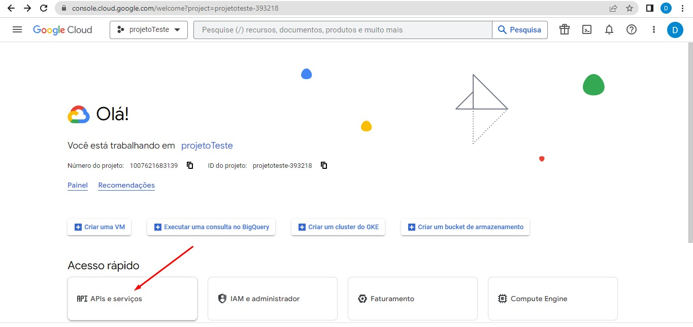
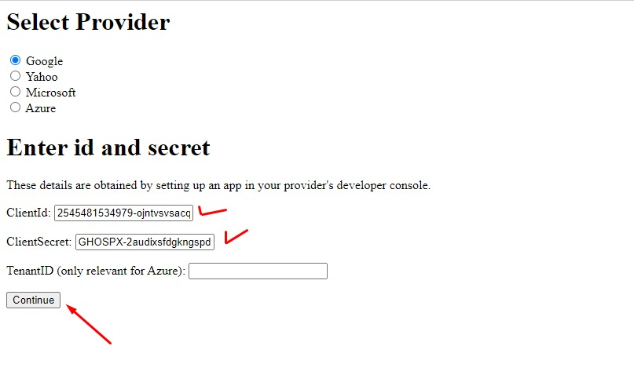

<h1>Sistema de Cadastro e Login</h1>

<p style="text-align: justify">Aplicação deste repositório é um sistema de login completo com página de cadastro de dados, scripts para validação de cadastro, recuperação de senha e token de sessão.</p>
<p style="text-align: justify">O projeto também apresentam um tutorial para utilização da biblioteca PHPmailer e do sistema de autenticação do Google, para utilização do Gmail como provedor.</p><br>

<p style="text-align:left">
&nbsp;
&nbsp;


<p style="text-align: justify"> Para conferir o resultado do sistema de login em produção é só <a style="text-decoration:underline" href="https://devat30.com/sistema_login">clicar aqui</a></p>

<h3 style="text-align: justify"> Neste projeto será detalhado como criar um sistema de login completo utilizando a biblioteca phpmailer.</h3>

<p style="text-align:justify">Esta iniciativa surge da dificuldade que encontrei como programador iniciante ao tentar implementar um sistema de login com envio de emails para validação de cadastro. O projeto que demandou essa funcionalidade foi o aplicativo chamado "safapp", que também está disponível nos meus repositórios.</p>

<p style="text-align:justify">Originalmente, o aplicativo utilizava uma versão antiga do PHPMailer que foi descontinuada devido a problemas de segurança. Como resultado, a funcionalidade de envio de emails utilizando aquela versão ficou comprometida. Além das dificuldades para implementar a nova versão do PHPMailer, enfrentei desafios para configurar o Gmail como provedor de email, uma vez que era necessário utilizar um mecanismo de autenticação chamado OAuth. Mais detalhes sobre esse processo serão apresentados ao longo desta documentação.</p>

<p style="text-align:justify">É importante ressaltar que esta iniciativa tem como objetivo reforçar o aprendizado e fornecer um guia para novos desenvolvedores. A documentação abordará a implementação do PHPMailer e a autenticação de emails usando o Gmail, mas isso é algo opcional, você só precisará fazê-lo se desejar (risos).</p>

<p style="text-align:justify">Embora a documentação oficial seja completa e abrangente, devido à minha inexperiência, encontrei um pouco mais de dificuldade durante o processo.</p>

<p style="text-align:justify">Por fim, a ideia é fornecer um passo a passo detalhado para a implementação desse recurso, disponibilizando códigos comentados que servirão como referência e auxílio para quem estiver interessado.</p>

<p style="text-align:justify">Atenção: Este repositório contém alguns arquivos para uso do PHPMailer, porém, para utilizá-lo em produção, será necessário realizar a instalação completa. Os arquivos aqui disponibilizados são apenas para referência e representam apenas etapas do processo, exigindo poucas alterações.</p>

<h3 style="text-align:justify">Para visualizar os códigos comentados basta consultar os arquivos presentes na raiz do projeto e o arquivo db/conexao.php.</h3>
<p style="text-align:justify">Os principais scripts para o envio de email e demais funcionalidades encontram-se detalhadamente comentado nos arquivos:</p>

> conexao.php;
>
> > Funções importantes para tratamento de dados, autenticação de sessão e conexão com o banco remoto;

> cadastra.php;
>
> > Conteúdo bastante detalhado sobre as configuração do script de envio de email;

> confirmacao.php;
>
> > Entre outros, script para validação de cadastro;

> esqueci.php;
>
> > Entre outros, script complementar para geração de código que será validado na reformulação da nova senha;

> recupera-senha.php;
>
> > Entre outros, script para validação de código enviado na página de recuperação de senha e para atualização da nova senha;

<br><hr>

<h3 style="text-align:justify">Para visulizar o passo a passo de implementação do phpmailer e do sistema de autenticação do gmail veja a descrição abaixo;</h3>

<h3 style="text-align:justify">1. Instalação do phpmailer no projeto:</h3>

<h4> 1.1 Instalação do composer:</h4> 
<a alt="instalação do composer" style="font-weight:bold; text-decoration:underline" src="https://getcomposer.org/">Composer</a><hr>

<p style="text-align:justify">O Composer é uma ferramenta de gerenciamento de dependências para o PHP. Ele fornece uma maneira conveniente de gerenciar as bibliotecas e pacotes que um projeto PHP utiliza. Com o Composer, é possível definir as dependências do seu projeto em um arquivo chamado "composer.json" e o Composer se encarrega de baixar, instalar e atualizar essas dependências de forma automatizada.</p>

<p style="text-align:justify">Foi a melhor maneira que encontrei de instalar todas as dependências necessárias com menos esforçlo possível. Ou seja, tenha o composer instalado na sua máquina.</p><hr>

<h3 style="text-align:justify"> 2. Com o composer instalado, abra o seu projeto e na raíz dê o seguinte comando:</h3>

No terminal:

`composer require phpmailer/phpmailer`

> Verifique que na raíz do seu projeto serão criado os seguintes arquivos:
>
> > Um diretório chamado **vendor**;
> >
> > > Este diretório não faz parte do PHPmailer mas gera o arquivo **autoload.php**, que contém o código necessário para carregar automaticamente as classes e arquivos de dependências do seu projeto.
> > >
> > > É por meio do autoload.php que as classes e funções definidas nas bibliotecas e pacotes instalados pelo Composer são disponibilizadas para uso no seu código.
> >
> > Um arquivo chamado **composer.json**;
> >
> > > O arquivo composer.json é o arquivo de configuração principal do Composer. Nele, você define as informações do seu projeto, como nome, descrição, versão, autor, licença, entre outras.
> > >
> > > Além disso, é no composer.json que você especifica as dependências do seu projeto, ou seja, as bibliotecas ou pacotes que ele precisa para funcionar corretamente.
> > > Um arquivo chamado **composer.lock**;
> >
> > > Neste arquivo você encontrará o seguinte trecho:

```
"suggest": {
                "ext-mbstring": "Needed to send email in multibyte encoding charset or decode encoded addresses",
                "ext-openssl": "Needed for secure SMTP sending and DKIM signing",
                "greew/oauth2-azure-provider": "Needed for Microsoft Azure XOAUTH2 authentication",
                "hayageek/oauth2-yahoo": "Needed for Yahoo XOAUTH2 authentication",
                "league/oauth2-google": "Needed for Google XOAUTH2 authentication",
                "psr/log": "For optional PSR-3 debug logging",
                "symfony/polyfill-mbstring": "To support UTF-8 if the Mbstring PHP extension is not enabled (^1.2)",
                "thenetworg/oauth2-azure": "Needed for Microsoft XOAUTH2 authentication"
            },
```

> > > Para utilização do Gmail como provedor, você utilizará duas desas sugestões e deverá cumprir a etapa abaixo.

<h3 style="text-align:justify"> 3. Para utilização do Gmail como provedor, abra o arquivo composer.json e insira as seguintes dependências:</h3>

```
"league/oauth2-google": "^4.0",
"ext-openssl": "*"
```

<p>Logo, seu composer.json deverá ficar assim:</p>

```
{
    "require": {
        "phpmailer/phpmailer": "^6.8",
        "league/oauth2-google": "^4.0",
        "ext-openssl": "*"
    }
}

```

<p style="text-align:justify"><b>OBS:</b> Se vc quiser outro provedor para a autenticação, verifique as sugestões no arquivo composer.lock em "suggest":

<h3 style="text-align:justify"> 4. Após a inserção das dependências dê o seguinte comando no terminal:</h3>

```
composer require ext-openssl league/oauth2-google
```

<hr>
<p style="text-align:justify"> Pronto, agora é fazer algumas configurações, a primeira delas é apontar corretamente os diretórios. 
Nos seus scripts, verifique os caminhos apontados nos requires, principalmente do autoload.php (arquivo presente no diretório vendor).</p>

<h3 style="text-align:justify"> 5. Configuração do oAuth: obtendo as credenciais:</h3>

##### 5.1 Abra o google cloud console:

> 5.1.1 Crie um projeto:

<br>


- Entre no projeto e vá em API e Serviços:<br>
  

> 5.1.2 Vá em credenciais:

> > 5.1.2.1 Configurar tela de consentimento;
> >
> > > Nesta área você irá preencher várias informações sobre a sua aplicação - preencha o máximo de informações que puder, mas você só conseguirá avançar se informar os campos obrigatórios;

<br>
<br>
<br>
<br>

> > 5.1.2.2 Preenchido as informações da Tela de permissão OAuth, a próxima tela é a de Escopo. Nesta tela, inicialmente, você não é obrigado a preencher nada então apenas avance.
> >
> > A próxima tela é para adicionar usuários de teste, adicione os emails, principalmente o GMAIL que você irá utilizar para envios de mensagem.
> > <br>

<br>

> > Finalize gerando o resumo de cadastro da sua aplicação.
> > <br>

<br>

> > 5.1.3 Agora sim,vá em credenciais e clique em criar credenciais:
> >
> > > 5.1.3.1 Selecione Criar ID do cliente OAuth:

- Tipo de Aplicativo: Conforme sua necessidade.
  - Se for uma página web: Aplicativo da Web;
- Insira o nome da sua aplicação;
- Em URIs de redirecionamento autorizados, clique em Adicionar URI e então copie o caminho da sua url até o arquivo get_oauth_token.php;

> > Exemplo: https://seudominio/seu_caminho/db/vendor/phpmailer/phpmailer/get_oauth_token.php

**Veja a sequencia de imagens abaixo:**

<br>
<br>
<br>
<br>

> > Clique em Criar:
> >
> > > Pronto, agora você tem o ID do Cliente e a Chave Secreta do Cliente. São dois identificadores que ficarão disponíveis no console do seu projeto;

<br>
**OBS:** Não se preocupe com a exibição das minhas credenciais, o projeto foi criado apenas para este tutorial e já foi excluido.

> > > Você deve inserir as suas credenciais no script para envio de email utilizando o gmail como seu provedor, conforme o exemplo abaixo:

```
$clientId = '375481534178-ojpdt8jqev3cj8bjkgzbjcfq4tbco30m.abuild.googleusercontent.com';
```

```
 $clientSecret = 'ZOFTPX-2Cwf1iLUPUWtUzGBIYG7xAly7jV5';
```

```
$refreshToken = '3//55JnP7IX-L9Ir68B7AuVBhPvvKPyFZRuNn -I8liCgYIARAAGAESNwF_gHAG2Bh9d60MBm27o_f910OZxbJCocC9ZR7odCw6gh-0Q';
```

**ATENÇÃO:** O refreshTOken ainda não foi gerado, para gerá-lo você terá que copiar a URL https://seudominio/seu_caminho/db/vendor/phpmailer/phpmailer/get_oauth_token.php em uma aba do navegador e então você será redirecionado para uma página e preencherá um formulário.

<br>

- OBS: Após preencher o formulário você deverá acessar a página com um email habilitado para teste na tela de configuração do oAuth, conforme explicada na sessão anterior;

> > Você informará que o Google será seu provedor;
> >
> > > Irá passar o clientId e o clientSecret nos campos do formulário e irá submetê-lo;

<br>

> > > Se tudo der certo, será gerado um refreshToken similar ao exemplificado acima. Veja a tela que será exibida abaixo:

<br>

<h4 style="text-align:justify"> 6. Com todas as três credenciais acima, é terminar de configurar o script para envio de emails conforme apresentado no diretório examples do diretório src do phpmailer ou conforme demonstrado no script em cadastrar.php;</h4>

Feito isso, é para dar certo!
<span style="font-size: 30px;">&#x1F60E;</span>

<h4>
Créditos:
</h4>

> **Professor Dimitri Teixeira**, que tem me ensinado programação web e mobile há alguns anos. Sendo boa parte deste projeto, inclusive, aprendido em uma de suas aulas;
>
> > https://programacaoweb.com.br/

> **Professor Rodrigo Lima**, instrutor do programa de mentoria TypeDev, que além do acompanhamento e ensinamentos sobre programação e mercado, me ensinou como estruturar um projeto para apresentação no github;
>
> > https://github.com/rodrilima
